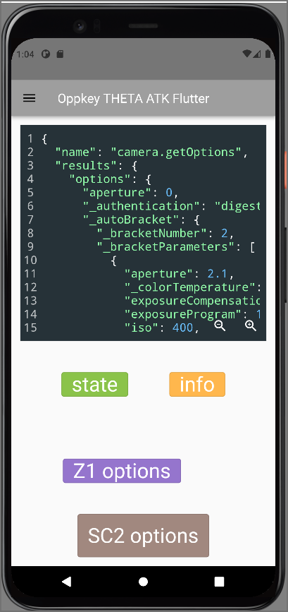

<!-- 
This README describes the package. If you publish this package to pub.dev,
this README's contents appear on the landing page for your package.

For information about how to write a good package README, see the guide for
[writing package pages](https://dart.dev/guides/libraries/writing-package-pages). 

For general information about developing packages, see the Dart guide for
[creating packages](https://dart.dev/guides/libraries/create-library-packages)
and the Flutter guide for
[developing packages and plugins](https://flutter.dev/developing-packages). 
-->

# thetaf

Flutter widgets for RICOH THETA camera application prototyping.
Package is intended for API testing and rapid prototyping.
This is not suitable for production applications.

## Features

<!-- TODO: List what your package can do. Maybe include images, gifs, or videos. -->

* API request and response for [RICOH THETA WebAPI v2.1](https://api.ricoh/docs/theta-web-api-v2.1/)
* Widgets can be used on iOS, Android, and desktop. Web is not supported.




## Getting started

<!-- 
TODO: List prerequisites and provide or point to information on how to
start using the package. -->

* RICOH THETA must be connected to development workstation using Wi-Fi with
the camera as the access point

## Usage

### Start with `ThetaWindow` as root widget under `Scaffold`

```dart
import 'package:thetaf/thetaf.dart';
...
return MaterialApp(
    home: Scaffold(
        body: ThetaWindow(
            child: Column(

```

### Put thetaf widgets as children of `ThetaWindow`

## Additional information
<!-- 
TODO: Tell users more about the package: where to find more information, how to 
contribute to the package, how to file issues, what response they can expect 
from the package authors, and more. -->
